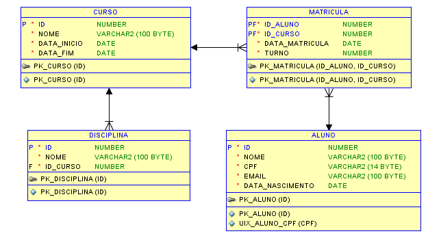

# Processo seletivo - Desenvolvedor Java Full Stack

### Desafio
- Desenvolver uma aplicação web que permita realizar o cadastro de alunos, disciplina e cursos de uma universidade. O sistema deve permitir realizar a matrícula do aluno no curso, visualizar a lista de alunos, cursos e disciplinas.

### Modelo de dados

Para o atributo MATRICULA.TURNO, considerar os valores abaixo:
- 1 = Manhã
- 2 = Tarde
- 3 = Noite

### Premissas
- O backend deverá ser implementando com a linguagem Java
- O backend e o frontend deverão ser projetos separados

### Requisitos
- Curso
  - Listar, Cadastrar, Alterar, Excluir
  - Não permitir excluir um curso caso o mesmo possua algum aluno matriculado

- Disciplina
  - Listar, Cadastrar, Alterar, Excluir
  - Não permitir excluir uma disciplina que está associada a algum curso que possui pelo menos um aluno matriculado
  - Listar e filtrar disciplinas por nome e por curso

- Aluno
  - Listar, Cadastrar, Alterar, Excluir
  - Não permitir o cadastro de alunos com o mesmo CPF

- Matrícula
  - Listar, Cadastrar, Alterar, Excluir

### Avaliação
- Mapeamento correto de entidades com JPA
- Design de API baseada em REST
- Tratamento de erros no backend e no frontend
- Reutilizaçao de código
- Estrutura física do projeto backend(camadas)
- Isolamento de responsabilidades projeto frontend(componentes de visualização e acesso e dados)
- Logs de erros com biblioteca de logs

### Diferenciais
- Autenticacão
- Paginacão
- HQL
- Spring Boot
- Vue.js
- Swagger
- Testes do código
- Utilização de boas práticas de UX na solução
- Adaptar o frontend para dispositivos móveis
- Utilizar Docker, transformar a aplicação em container

### Entrega
- Link do projeto no GitHub.
- Documentação do processo necessário para rodar a aplicação(README).
- Soluções parcias serão aceitas.
